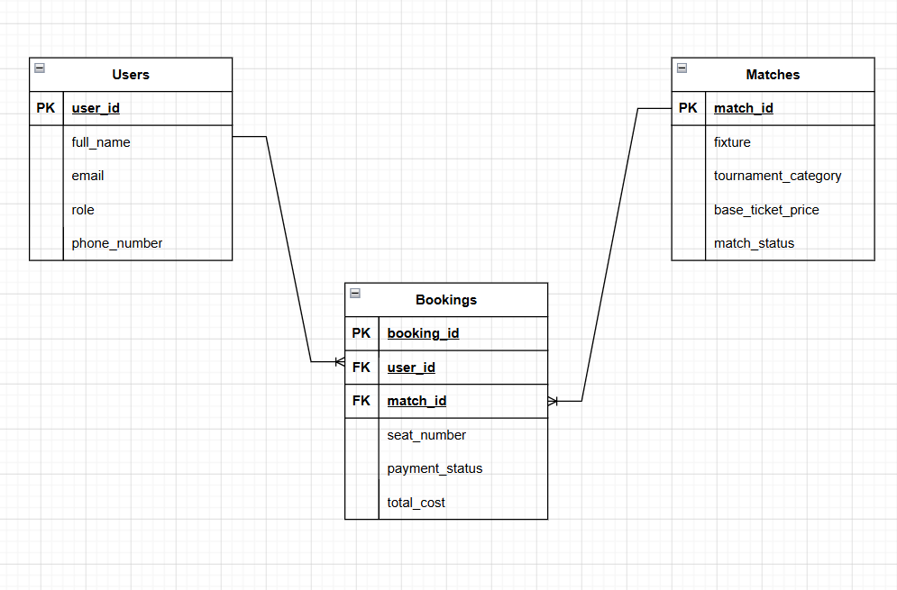

# Football Ticket Booking System

A relational database design and SQL implementation for a football tournament ticket booking platform. The system manages user accounts (ticket managers and fans), match listings, and individual ticket booking transactions.

## Overview

This project models a database for a football ticket booking system, covering:

- **Entity Relationship Diagram (ERD)** designed using Crow's Foot notation
- **Schema creation** with primary keys, foreign keys, and data validation constraints
- **Query implementations** covering filtering, joins, null handling, and aggregation

## Database Schema

The system is built around three core tables:

### Users
Tracks administrative staff (Ticket Managers) and customers (Football Fans) who use the platform.

| Field | Description |
|---|---|
| `user_id` | Primary key, unique identifier for each user |
| `full_name` | First and last name of the user |
| `email` | Login email address (unique) |
| `role` | Access level — `Ticket Manager` or `Football Fan` |
| `phone_number` | Contact mobile number |

### Matches
Catalogs tournament fixtures, categories, and base ticket pricing.

| Field | Description |
|---|---|
| `match_id` | Primary key, unique identifier for each match |
| `fixture` | Competing teams (e.g., Real Madrid vs Barcelona) |
| `tournament_category` | League or cup title (e.g., Champions League) |
| `base_ticket_price` | Base price for a standard entry seat |
| `match_status` | Ticket availability — `Available`, `Selling Fast`, `Sold Out`, `Postponed` |

### Bookings
Transactional table linking users to the matches they've booked tickets for.

| Field | Description |
|---|---|
| `booking_id` | Primary key, unique transaction identifier |
| `user_id` | Foreign key referencing `Users.user_id` |
| `match_id` | Foreign key referencing `Matches.match_id` |
| `seat_number` | Allocated seat (e.g., A-12), nullable |
| `payment_status` | `Pending`, `Confirmed`, `Cancelled`, `Refunded`, nullable |
| `total_cost` | Final invoice price for the booking |

## Entity Relationship Diagram

**Relationships:**
- **One User → Many Bookings**: A fan can purchase tickets for multiple matches.
- **One Match → Many Bookings**: A single match can have thousands of associated bookings.
- Each row in `Bookings` maps exactly one user to one match for a specific seat.

## Constraints

- `user_id`, `match_id`, and `booking_id` are primary keys.
- `email` in `Users` is unique.
- `role` is restricted to `Ticket Manager` or `Football Fan` via a check constraint.
- `base_ticket_price` and `total_cost` cannot be negative.
- `match_status` and `payment_status` are restricted to predefined enum-like values.
- `seat_number` and `payment_status` allow `NULL` to support unassigned seats and pre-payment bookings.

## Queries

All SQL queries are available in [`QUERY.sql`](QUERY.sql), including:

- Filtering matches by tournament category and status
- Pattern-based user search (`LIKE` / `ILIKE`)
- Handling missing data with `IS NULL` and `COALESCE`
- Joining bookings with user and match details (`INNER JOIN`)
- Ranking and pagination queries (`ORDER BY`, `LIMIT`, `OFFSET`)

## Tech Stack

- **Database**: SQL (PostgreSQL / MySQL compatible)
- **Design Tool**: Crow's Foot ERD notation

## Author

Built by [ibrahim3761](https://github.com/ibrahim3761) as part of a database design coursework project.